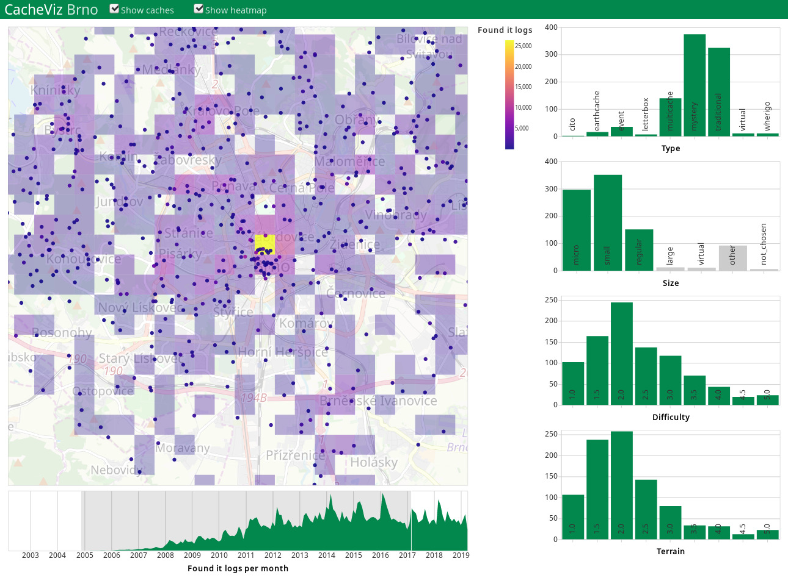

# CacheViz

Vizualization of geocache caches in Brno region.

Repo: https://github.com/Linzee/cacheviz
Available on web: http://ienze.me/cacheviz/

### Geocaching

Geocaching is a real-world, outdoor treasure hunting game using GPS-enabled devices. Participants navigate to a specific set of GPS coordinates and then attempt to find the geocache (container) hidden at that location.

## Inspiration

I fancied idea of visualizing events (described by timestamp, location and some parameters) concerning some local area (Like Czech republic or Brno). I tried to find such source data and in the end I choose Geocaching because it can be quite easily accessed and contains a lot of events.

## Interaction

- Dragging on map selects rectangular area of caches to display in filters and timeline.
- Use shift-drag to navigate map and shift-scroll to zoom.
- Dragging on a timeline filters logs range (only caches with some logs in this range are then displayed on map).
- Clicking on columns of histograms filters caches by their particular type, size, difficulty and terrain. Multiple columns can be selected by shift-clicking.
- It is possible to display individual caches, heatmap, or both.

## Data

### Description

Data are stored in files `caches.csv` and `caches_logs.csv`.

#### Caches `caches.csv`

- wp - ID of the cache
- name - name of the cache
- location - latitude and longitude of cahce
- type - one of traditional, multi-cache, mystery, unknown, letterbox hybrid, event, mega-event, giga-event, earthcache, cito, cache in trash out event, webcam, virtual, wherigo, lost and found event, project ape, groundspeak hq, gps adventures exhibit, groundspeak block party, locationless (reverse); only subset of them appears in Brno region (9 types)
- state - whether this cache is visible (always true)
- size - one of micro, small, regular, large, not_chosen, virtual, other
- difficulty - value between 1.0 and 5.0
- terrain - value between 1.0 and 5.0
- favorites - (currently not used)
- hidden - date when cache was created (currently not used)
- author - author of the cache (currently not used)
- attributes - JSON describing attributes of place (currently not used)
- mx and my - local position for displaying on map of Brno

#### Logs `caches_logs.csv`

- wp - ID of the cache
- date - date of first day of month for aggregated data
- type - type of log, one of enable_listing, found_it, didnt_find_it, note, needs_maintenance,...
- count - count of logs for given cache ID, month and log type

### Source

I gathered data myself using [pycaching](https://github.com/tomasbedrich/pycaching) library. There is few important notes to mention:

- None: Only caches which are currently active are enclosed in the data. Canceled caches are not in the data.
- None: Data are downloaded only up to 2019-04-20 (they can be updated by running appropriate scripts again).
- Note: Logs for events were not downloaded for some reason, therefore this caches are not displayed correctly.
- Note: 8km radius from center of Brno is gathered by default.

### Preprocessing

Preprocessing is done by custom python scripts using Pandas.

- Calculate display coordinates (mx, my) from latitude and longitude.
- Gathered data contain each individual log. I aggregate count of cache logs by their cache id, type, and year-month to reduce amount of data (34MB -> 2.8MB). Raw data could also be used but processing them on the fly was too slow so I precalculated the values.

## Used libraries

### Pycaching

https://github.com/tomasbedrich/pycaching

Previously mentioned in section `Data > Source`. Used to gather caches and their logs from Brno region.

### Vega

https://vega.github.io/

Vega is visualization grammar, a declarative language for creating, saving, and sharing interactive visualization designs. With Vega, you can describe the visual appearance and interactive behavior of a visualization in a JSON format, and generate web-based views using Canvas or SVG.

My visualization consists of three different Vega-lite (high-level specification compiled into Vega language) plots - map, timeline and filters. Vega-lite language can be greatly utilized to quickly build visualization of data. But it is not intended for complex interactions, therefore I choose to implement data filtering and aggregation in JavaScript using following library.

I choose this library because Kibana allows writing visualizations in Vega and I wanted to learn it for different project.

### Data-Forge

https://github.com/data-forge/data-forge-ts/

Data-Forge is data transformation and analysis toolkit. I used it for data filtering, aggregation and joining sources (caches and logs) when user interacts with visualization. It is also used when computing values for heatmap.

## Problems

- I had to repair bug in library pycaching used for collection of data. One type of logs was missing. (Merge request accepted)
- Using fields named "x" or "y" breaks Vega's interval selection! There goes hours of trying to find what is wrong :D

## Critical assessment and future work

### Usefulness of visualization

Currently caches are set up and managed by users of Geocaching. It is not done currently but visualization like this can be useful for cache management. This project can be used for finding most frequented or problematic caches with specific parameters or location.

Another possible extension of this visualization would be views allowing inspection of caches similarity. List of users who found each cache can be extracted and utilized for visualization of similarity.

Visualization is still quite generic, so it can be modified for displaying any logs associated with time and location.

### Vega

Based on my experience with Vega I think it is really useful tool for quick building of simple visualizations. It can handle even interactive views but only on simple "one table" datasets. Some learning of language is required at first, but afterwards allows quick definition and embedding of visualizations. Visual style is fully customizable and can be shared between visualizations. Downside is that debugging of problems really painful - JSON specification does not allow for any debugging.

### Current problems

- Size of views (map, timeline and filters) are fixed and does not adapt to monitor size at all.
- There are no animations explaining changes in data caused by interaction. (This is limitation of use Vega, it does not support animations.)
- Interaction and filtering of data can be quite slow on some less powerful devices. This is probably caused by quite large amount of caches and logs and straightforward implementation of working with data, but I did not inspect this further.
- Heatmap does not correspond to event locations fully, it is shifted a bit.
